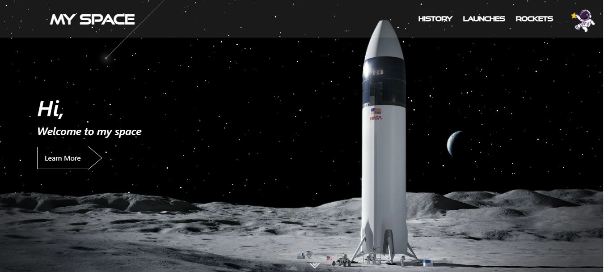

# My Space

Hi, Welcome to my space

## To run the app

First, install node_modules to download all the dependancy package

```bash
  npm i 
```
    
Now, run the app using,

```bash
  npm start 
```
    

## 🔗 Live
Have a look at https://my-space-jayjarvis.vercel.app/

## Screenshots



## Tech used

* React
* Tailwind CSS
* Typescript
* SCSS


## 🔗 About me
## Jayaram Karunakaran

[](https://www.linkedin.com/in/jayaram-karunakaran/)


## 🛠 Skills
React.js, Next.js, Redux, Bootstrap, Typescript, Tailwind Css, HTML, SCSS, Storybook, Rollup, Git.

Basics in React native, Flutter, Angular, Vue.js, Node.js and MongoDB.

Good at - Redux, Reusable, Responsive UI in cross platforms.
